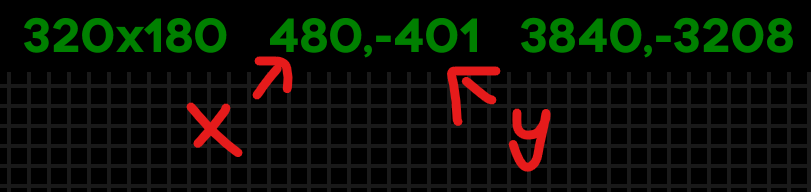

# celestetools

## `annotate_map`

**Installation**
```sh
cargo install --git https://github.com/jakobhellermann/celestetools map_annotate
```

**Usage**

1. Download @viddie's [Celeste Consistency Tracker](https://gamebanana.com/mods/358978) mod.
2. Enable `Mod Options -> Consistency Tracker -> Physics Inspector Settings -> Recording Physics Enabled`
    - Optionally, increase the `Max Recent Recordings` from the default of 10
3. Run your TASes, or play the game. Every `console load`, savestate, or death, the current recording gets saved.
   
   The recordings can be found (and deleted) in `Celeste/ConsistencyTracker/physics-recordings/recent-recordings`.
4. Open the map in Lönn and do `Map -> Save Map Image` in the menu, save as e.g. `map.png`


Then, run
```sh
annotate_map map.png -o annotated.png --cct-recordings        # annotate with every recent path
annotate_map map.png -o annotated.png --cct-recordings --open # annotate and open in image viewer afterwards
annotate_map map.png -o annotated.png --cct-recordings city   # annotate with every path from a chapter matching the name 'city'
annotate_map map.png -o annotated.png --cct-recordings 0,1    # annotate with the last two paths

# ^ these will only work if your path visits the leftmost, rightmost, bottommost and topmost room in the map.
# If that isn't the case, you need to figure out at which tile position the topleft corner of the map begins.

annotate_map map.png -o annotated.png --cct-recordings --top-left 0,-401
```

To figure out the offset, hover the **leftmost** room in the debug map and copy the room's x position "320x180  <span style="color:red">**0**</span>,0  0,0", then find the **topmost** room and copy the room's y position "320x180 480,<span style="color:red">**-401**</span> 3840,-3208"
This will result in an offset of `--top-left 0,-401`.



## `celesteloader`

Rust crate for parsing celeste map files, mod zips and dialog files.

Source in [./crates/celesteloader](./crates/celesteloader/).